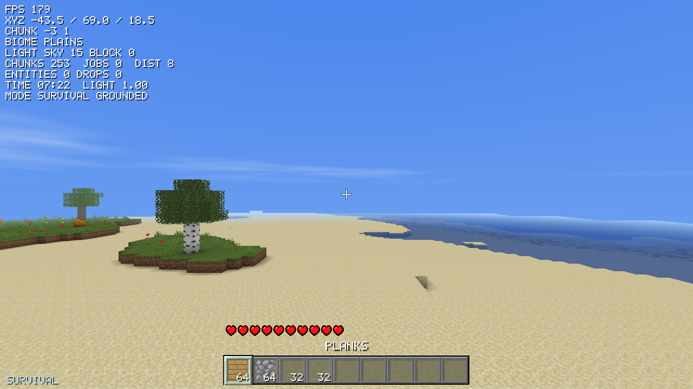
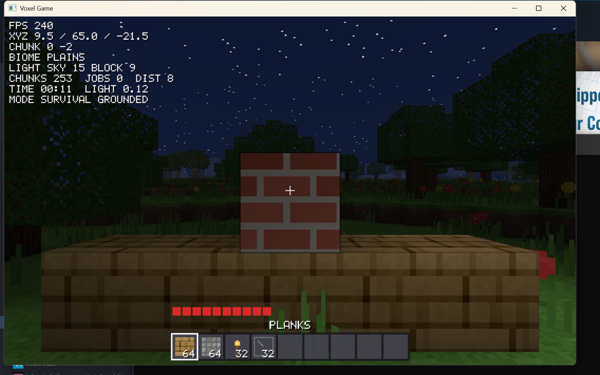

# VoxelEngine

A Minecraft-style voxel game written from scratch in C++17 and OpenGL 3.3.
No game engine, no vendored black boxes: the renderer, the OpenGL loader,
the world generator, the lighting, the physics and even the block textures
are all in this repo and all readable in an afternoon.





## What's in the game

**World**
- Infinite streaming terrain — chunks generate, light and mesh on worker
  threads as you walk, and unload behind you.
- 16 x 128 x 16 chunks, sea level at y=62.
- Seven biomes (ocean, beach, plains, forest, desert, mountains, snowy)
  chosen from continent / temperature / humidity noise fields.
- Perlin-noise terrain with rolling hills and ridged mountain spines,
  3D-noise cave systems, ore veins (coal, iron, gold, diamond, gravel,
  clay) layered by depth, oceans and frozen lakes.
- Oak and birch trees, cacti, tall grass, flowers and pumpkins. Trees are
  placed from a deterministic hash of world position, so canopies cross
  chunk borders seamlessly without any cross-chunk writes.
- 35 block types.

**Rendering**
- Loads real Minecraft resource packs from `assets/textures/block` at any
  resolution, and falls back to procedurally painted textures for anything
  the pack is missing — so the game still runs with no art files at all
  (`src/Renderer/Atlas.cpp`).
- **LabPBR support**: if the pack ships `_n` and `_s` maps, the chunk
  shader does per-pixel normal mapping, specular highlights, material
  ambient occlusion and emissive pixels. No Iris or BSL needed — the
  lighting is implemented directly in `assets/shaders/chunk.frag`.
  Toggle it in-game with `P`.
- Per-tile mipmapping: each atlas tile is downsampled using only its own
  pixels, so distant terrain stops shimmering without tiles bleeding into
  each other.
- Animated water and lava, driven from the pack's frame strips.
- Smooth lighting: per-vertex ambient occlusion plus flood-filled skylight
  and block light, so caves are dark and torches actually illuminate.
- Particle system: break debris, mining chips and landing puffs, each
  sampling a patch of the source block's own texture.
- Day/night cycle on a 20-minute clock, with an analytic sky shader —
  gradient, sun and moon discs, stars that fade in at dusk, and a drifting
  procedural cloud layer.
- Distance fog matched to the horizon colour, plus an underwater tint.
- Separate transparent pass for water, glass and ice, sorted back to front.
- Frustum culling, chunk-boundary face culling, back-face culling.

**Audio**
- Every sound is synthesised at startup — filtered noise bursts and damped
  tones shaped per material (`src/Audio/AudioEngine.cpp`). Like the
  textures, there are no audio files to ship.
- Per-material dig, footstep and place sounds, plus jump, landing, damage
  and pickup. Mute with `M`.

**Menus and game modes**
- Title screen, new-world screen, pause menu and death screen, all
  mouse-driven over a drifting sky backdrop.
- **Survival** — take damage, mine for blocks, respawn when you die.
- **Creative** — flight, unlimited blocks, nothing can hurt you, no hearts.
- **Hardcore** — survival with one life. Dying ends the run and the world
  is deleted, and the HUD uses Minecraft's darker hardcore hearts.
- Hearts are drawn from the resource pack's own sprites (full / half /
  empty, with hardcore variants), falling back to a hand-drawn 9x9 heart
  when no pack is installed.

**Gameplay**
- Walk, sprint, sneak (won't walk off ledges), jump, swim, and fly.
- Mining takes time based on block hardness, with a cracking overlay.
  Broken blocks pop out as tumbling item entities that fall, settle and
  get pulled towards you when you walk close.
- Place blocks, pick blocks with middle click, 9-slot hotbar, 36-slot
  inventory, creative-mode block palette.
- Health, fall damage, slow regeneration, death and respawn.
- The world saves to disk and reloads where you left off — only chunks you
  actually changed are written, the rest regenerate from the seed.

## Controls

| Input | Action |
|---|---|
| Mouse | Look |
| W A S D | Move |
| Space | Jump / fly up / swim up |
| Left Shift | Sneak (fly down while flying) |
| Left Ctrl | Sprint |
| Left click (hold) | Mine |
| Right click | Place |
| Middle click | Pick block |
| 1-9 / scroll | Select hotbar slot |
| E | Inventory / block palette |
| F | Toggle flying (creative only) |
| F3 | Debug overlay |
| F2 | Save a screenshot to `screenshots/` |
| P | Toggle resource-pack PBR shading |
| M | Mute |
| `[` `]` | Render distance |
| Esc | Pause menu |

## Texture packs

The game reads vanilla Minecraft texture names, so most resource packs
drop straight in:

```powershell
powershell -ExecutionPolicy Bypass -File tools\install-texture-pack.ps1 -Zip "C:\path\to\pack.zip"
build.bat
```

That copies just the ~50 textures the game uses (plus any `_n`/`_s` PBR
maps) into `assets/textures/block`. Delete that folder to go back to the
built-in procedural textures. Tile resolution is detected automatically and
capped at 256px per tile; packs above that are box-filtered down.

Texture packs are *not* part of this project — they stay in
`assets/textures/`, which is gitignored, so you don't accidentally
redistribute someone else's art.

## Running in a browser

The engine also compiles to WebAssembly + WebGL2, so it can be hosted as a
static site — no server-side anything, and no domain needed to test it.

```powershell
powershell -ExecutionPolicy Bypass -File tools\build-web.ps1 -Serve
```

Then open `http://localhost:8080/index.html`. The output in `build-web/`
(`index.html`, `.js`, `.wasm`, `.data`) is roughly 1.3 MB total and can be
dropped on GitHub Pages, itch.io, Netlify or Cloudflare Pages as-is.

The web build differs from the native one in two deliberate ways:

- **Single-threaded.** WebAssembly threads need `SharedArrayBuffer`, which
  requires COOP/COEP headers most static hosts don't send. Chunk work is
  queued and run against a per-frame time budget instead
  (`ThreadPool::runPending`), with a smaller render distance to match.
- **Lower-resolution textures.** Everything is baked into the page
  download, so `tools/build-web.ps1` stages the 32x set from
  `assets/textures/block32` rather than whatever the desktop build uses.

## Building

You need **CMake 3.20+**, **Git**, and a **C++17 compiler**. On Windows that
means Visual Studio (or the Build Tools) with the "Desktop development with
C++" workload — that install also bundles CMake and Ninja, which is what
`build.bat` uses.

CMake downloads SDL2 and GLM itself on the first configure, so there are no
dependencies to install by hand. The first build takes a few minutes while
SDL2 compiles; after that it is cached in `build/_deps`.

### Windows, one command

```bash
build.bat
```

Then run `build\VoxelEngine.exe`. Optionally pass a window size:
`build\VoxelEngine.exe 1600 900`.

### VS Code

Install the recommended extensions when prompted (CMake Tools and C/C++),
pick your MSVC kit, then use **CMake: Build** and the Run button. `F5`
debugging is already configured in `.vscode/launch.json` (switch `type` from
`cppvsdbg` to `cppdbg` if you use MinGW).

### Any platform, by hand

```bash
cmake -S . -B build -G Ninja -DCMAKE_BUILD_TYPE=Release
cmake --build build
```

Run it from the `build` directory (that's where `assets/` and your `world/`
save folder live).

## How the code fits together

```
src/
  main.cpp              Entry point; optional width/height arguments
  Core/
    Application.*       Game loop, input handling, HUD, mining/placing
    Window.*            SDL window + OpenGL context
    Input.*             Per-frame keyboard/mouse state
    GLFunctions.*       Hand-written OpenGL 3.3 loader (no GLAD/GLEW)
    ThreadPool.*        Workers for chunk generation and meshing
  Renderer/
    Shader.*            GLSL loading/compiling with uniform caching
    Mesh.*              VAO/VBO wrapper with a described attribute layout
    Camera.*            Orientation, view/projection, frustum extraction
    Atlas.*             Procedurally painted block texture atlas
    AtlasTiles.h        Tile index constants shared with the block table
    Font.* UIRenderer.* 5x7 bitmap font and batched 2D HUD drawing
    SkyRenderer.*       Full-screen analytic sky, sun, stars, clouds
    SelectionRenderer.* Block outline and mining crack overlay
  World/
    Block.*             Block table: textures, hardness, light, collision
    Chunk.*             Block + light storage, chunk state machine
    ChunkMesher.*       Padded snapshot -> vertices, with AO and smooth light
    WorldGen.*          Biomes, terrain, caves, ores, trees, decoration
    Noise.*             Perlin noise, fBm, ridged noise, hashes
    World.*             Chunk streaming, light propagation, raycasting
    WorldSave.*         Run-length-encoded chunk and level serialisation
  Player/
    Player.*            Gravity, collision, swimming, fall damage
    Inventory.*         Hotbar and storage slots
  Entity/
    DroppedItems.*      Item entities: physics, magnetism, pickup
    Particles.*         Camera-facing debris sprites
  Audio/
    AudioEngine.*       Procedural sound synthesis and mixing
assets/shaders/         chunk, sky, ui and line GLSL programs
web/shell.html          Page wrapper for the browser build
tools/                  Texture-pack installer, web build, screenshots
```

Start with `Core/Application.cpp` — `run()` is the whole frame in one
screenful: poll input, simulate the player, stream the world, draw. Then
follow whichever subsystem you want to change.

A few things worth understanding before you edit them:

- **Chunk meshing runs on worker threads** against a *copy* of the chunk
  plus a one-block border of its neighbours (`MeshSnapshot`). That copy is
  what makes the threading safe without locks, and what lets faces at chunk
  borders be culled correctly.
- **Lighting is a flood fill** over world coordinates, budgeted per frame so
  it never stalls a frame. Skylight falls straight down without weakening;
  everything else loses one level per block.
- **Nothing is loaded from disk except your save.** Textures are painted in
  code, terrain comes from the seed.

## Ideas for what to add next

Roughly easiest first:

1. An item system for things that aren't blocks (sticks, coal, tools),
   then crafting with a drag-and-drop grid and a crafting table.
2. Mobs — the entity system in `src/Entity` is the place to build on.
3. Chests and other blocks that hold state.
4. Flowing water instead of static source blocks.
5. Greedy meshing — merge adjacent identical faces to cut vertex counts.
6. Shadow mapping for real sun shadows.
7. Saving worlds in the browser build via IndexedDB (`-lidbfs.js`).
8. Multiplayer: split the world into a server and thin clients.
